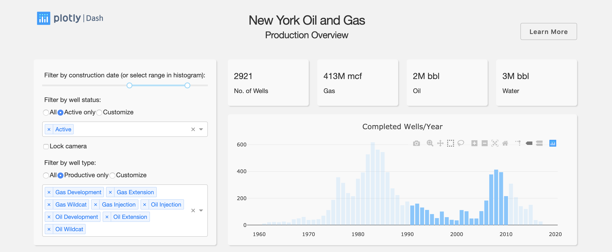
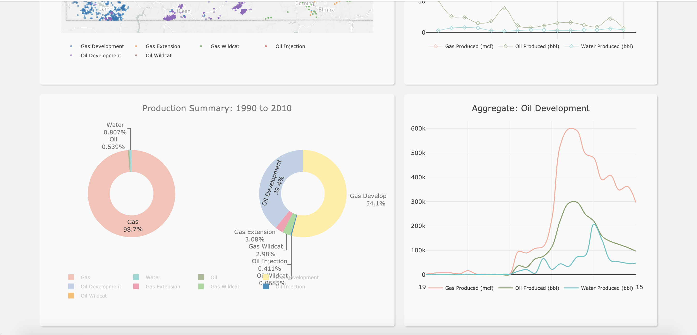

# Dash Natural Gas Well Production
App show real time data visualization using flask, plotly, gunicorn .. etc. 
DATASET - Oil_and_Gas_Annual_Production__1985_to_2000
## Getting Started

### Running the app locally
Clone the git repo, then install the requirements with pip

```

git clone https://github.com/dash-oil-py
cd dash-oil-py
pip install -r requirements.txt

```

Run the app

```

python app.py

```

## About the app

This Dash app displays oil production in western New York. There are filters at the top of the app to update the graphs below. By selecting or hovering over data in one plot will update the other plots ('cross-filtering').

## Built With

- [Dash](https://dash.plot.ly/) - Main server and interactive components
- [Plotly Python](https://plot.ly/python/) - Used to create the interactive plots

## Screenshots

The following are screenshots for the app in this repo:






